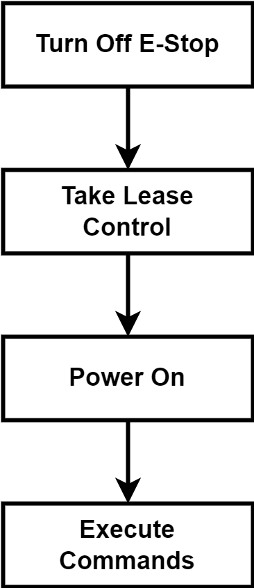
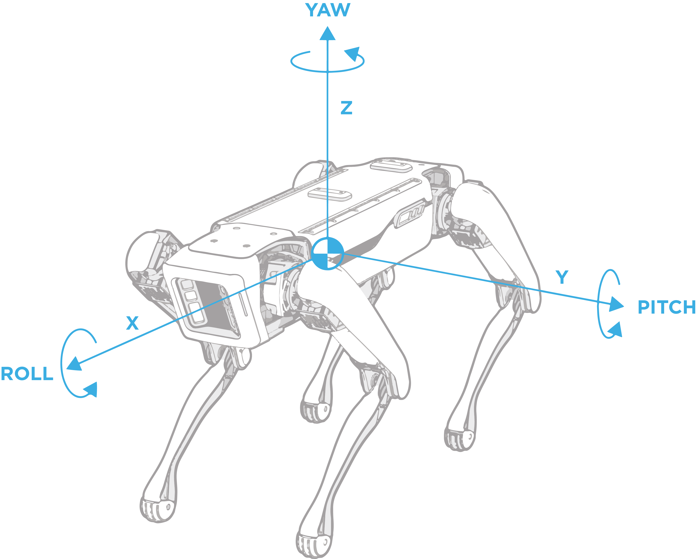
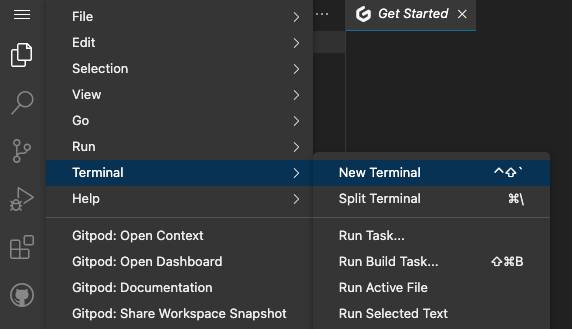
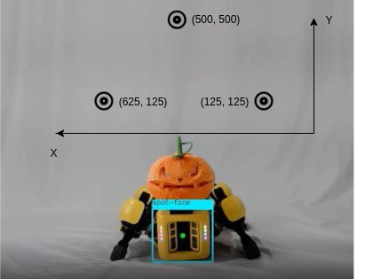

# Lesson #1 — Emergency Stop, Initialization, Body Position Control

## Intro

During this lesson, you will learn how to authorize yourself as a user, get motor power control and send basic commands to Spot.

## Theory

As and all serious robots, Boston Dynamics Spot has a protection mechanism — [E-Stop service](https://dev.bostondynamics.com/docs/concepts/estop_service) (Emergency Stop) that should always be active during the operation of the spot to avoid potential physical damage. Turning on E-Stop instantly freezes all joints (this happens without turning off the engines if the robot was turned on).

First of all, we should lease control over robot. There are two ways to do it - *acquire* or *take*. *Acquire* means asking for control in a gentle way, if anybody controls the robot now, your request will be declined. In another way, *take* means forcefully taking control, it doesn't matter if the current operator exists.

So, to make some movement, you should follow the scheme:



Robot Execution States

In this lesson you will learn how to control robot rotation by changing its *yaw*, *roll* and *pitch*. In the picture bellow the body frame coordinate system is shown:



Spot coordinates

> The angles in a code are representet in radians.
> 

As a result of the lesson, you’ll draw a first letter of your name in the air with Spot’s face. Let start the setup!

## Setup Gitpod

For this lesson, we'll be using Gitpod, a cloud-based IDE that allows you to practice without installing any special software on your computer.

1. Sign up for [Gitpod](https://gitpod.io/).
2. Got to our [Spot education environment](https://gitpod.io/#github.com/merklebot/spot-edu-environment) and open it in our browser. You will see the window with typical IDE functions. 
3. Click on Menu icon, then go to Terminal and create a new terminal.
    
    
    
4. Copy-paste this command:

```bash
python3 prepare_yggdrasil.py
sudo ./start_yggdrasil.sh
```

and press `Enter`.

1. Open new terminal (now you can do it by pressing `+` button) and test connection with command

```bash
ping6 200:42f6:d055:e74e:ce4a:35aa:953a:70f7
```

You should see something like this:

```bash
gitpod /workspace/spot-edu-environment (main) $ ping6 200:42f6:d055:e74e:ce4a:35aa:953a:70f7
PING 200:42f6:d055:e74e:ce4a:35aa:953a:70f7(200:42f6:d055:e74e:ce4a:35aa:953a:70f7) 56 data bytes
64 bytes from 200:42f6:d055:e74e:ce4a:35aa:953a:70f7: icmp_seq=1 ttl=64 time=846 ms
64 bytes from 200:42f6:d055:e74e:ce4a:35aa:953a:70f7: icmp_seq=2 ttl=64 time=172 ms
64 bytes from 200:42f6:d055:e74e:ce4a:35aa:953a:70f7: icmp_seq=3 ttl=64 time=172 ms
64 bytes from 200:42f6:d055:e74e:ce4a:35aa:953a:70f7: icmp_seq=4 ttl=64 time=197 ms
64 bytes from 200:42f6:d055:e74e:ce4a:35aa:953a:70f7: icmp_seq=5 ttl=64 time=219 ms
64 bytes from 200:42f6:d055:e74e:ce4a:35aa:953a:70f7: icmp_seq=6 ttl=64 time=242 ms
64 bytes from 200:42f6:d055:e74e:ce4a:35aa:953a:70f7: icmp_seq=7 ttl=64 time=368 ms
64 bytes from 200:42f6:d055:e74e:ce4a:35aa:953a:70f7: icmp_seq=8 ttl=64 time=172 ms
64 bytes from 200:42f6:d055:e74e:ce4a:35aa:953a:70f7: icmp_seq=9 ttl=64 time=210 ms
64 bytes from 200:42f6:d055:e74e:ce4a:35aa:953a:70f7: icmp_seq=10 ttl=64 time=235 ms
64 bytes from 200:42f6:d055:e74e:ce4a:35aa:953a:70f7: icmp_seq=11 ttl=64 time=358 ms
64 bytes from 200:42f6:d055:e74e:ce4a:35aa:953a:70f7: icmp_seq=12 ttl=64 time=281 ms
```

1. Before scheduled time we will send you private key to establish SSH connection.
2. Copy your private key to file `id_ed25519`. You can find the file in the sidebar explorer of *stop-edu-enviroment*.
3. **Add a blank line at the end of the** `id_ed25519` ****file, this is necessary for SSH to work properly.**** Press `Ctrl+S` to save changes.

If everything is ok, you can start completing the lesson by editing `lesson1.py`

To execute the code, use command:

```bash
sudo ./run_code.sh
```

**Remember to make sure no one else is running their program at the moment.**

## Schedule the practice session

Use the Spot scheduling website to pick the timeslot for your practice session:

[https://dapp.spot-sdk.education/#/checkout](https://dapp.spot-sdk.education/#/checkout)

Message arseniy@merklebot.com to request scheduling tokens. 

## Practice

Now we will make a simple script for Spot for drawing on screen using its head movements. 

```python
# Import Spot Control modules
import bosdyn.client
from bosdyn.client.robot_command import RobotCommandClient, blocking_stand
from bosdyn.client.robot_command import RobotCommandBuilder
from bosdyn.geometry import EulerZXY
import time

# ENTER YOUR AUTH DATA HERE
ROBOT_IP="192.168.50.3"
SPOT_USERNAME="student"
SPOT_PASSWORD=""

# Helpers to control camera drawing (you don't need to modify it)
import requests
VIDEOSERVER_URL="http://luke.merklebot:8000/"
VIDEOSERVER_TOKEN="1234"

def notify_start_line():
    requests.post(VIDEOSERVER_URL + "start_line", json={"token": VIDEOSERVER_TOKEN})

def notify_stop_line():
    requests.post(VIDEOSERVER_URL + "stop_line", json={"token": VIDEOSERVER_TOKEN})

def notify_clear_canvas():
    requests.post(VIDEOSERVER_URL + "clear_canvas", json={"token": VIDEOSERVER_TOKEN})

# Start with registering out SDK
sdk = bosdyn.client.create_standard_sdk('LessonOneClient')

# Create instance of robot and auth with credentials
robot = sdk.create_robot(ROBOT_IP)
robot.authenticate(SPOT_USERNAME, SPOT_PASSWORD)

# Create lease client and take exclusive control over Spot.  
lease_client = robot.ensure_client('lease')
lease = lease_client.take()
lease_keep_alive = bosdyn.client.lease.LeaseKeepAlive(lease_client)

# Try to power on the robot
robot.power_on(timeout_sec=20)
if robot.is_powered_on():
    print("Powered On")
		# If everything went smooth, Spot face lights should turn green
else:
		# In case of some problems, e.g. somebody stole control over robot
    print("Failed")
    exit(0)

# Synchronize Spor inner time with ours - to avoid outdated commands
robot.time_sync.wait_for_sync()

# To execute robot movement, create command client through which orders are sent
command_client = robot.ensure_client(RobotCommandClient.default_service_name)

# Start movement with simple stand up
blocking_stand(command_client, timeout_sec=10)

# Rotate robot body:
#  1. Build command for body rotation. It’s not an easy task to control robot motion with commands on low level. 
#     Bosdyn Client allow as to use a shortcut - RobotCommandBuilder. It contains a number of predefined commands, 
#     you need just to choose one of your liking and insert parameters
footprint_R_body = EulerZXY(yaw=0.1, roll=0.1, pitch=0.1)
cmd = RobotCommandBuilder.synchro_stand_command(footprint_R_body=footprint_R_body)
#  2. Execute builded command
command_client.robot_command(cmd)

time.sleep(2)

# Return robot state back
command_client.robot_command(RobotCommandBuilder.synchro_stand_command(footprint_R_body=EulerZXY(yaw=0, roll=0, pitch=0)))

time.sleep(2)

# Change robot height
cmd = RobotCommandBuilder.synchro_stand_command(body_height=0.1)
command_client.robot_command(cmd)

# Now we are ready to draw letter. 
def draw_letter(command_client):
		# Choose points to draw (see the coords explanation bellow)
    points_xy_draw = (
        (125, 125),
        (375, 875),
        (500, 500),
        (250, 500),
        (500, 500),
        (625, 125),
    )

    for x, y in points_xy_draw:
        convert = lambda x: (x / 1000 - 0.5) * -1
        x, y = map(convert, (x, y))
        footprint_R_body = EulerZXY(
            yaw=x, 
            roll=0.0, 
            pitch=y,
        )
        cmd = RobotCommandBuilder.synchro_stand_command(footprint_R_body=footprint_R_body)
        command_client.robot_command(cmd)
        time.sleep(1)

notify_clear_canvas()
notify_start_line()
draw_letter(command_client)
notify_stop_line()

# Turn off the robot gracefully
robot.power_off(cut_immediately=False)
```

> If we need to move head of Spot to some point in camera, we should some large calculations with many non-linear parameters, which is not a simple task at all. But we could say, that locally, yaw and pitch angles could be approximately used as a cartesian coordinates with some coefficient on a picture.
> 



Now you can try to run the script and see the result. Don’t forget to save your code with Ctrl+S:

```bash
sudo ./run_code.sh
```
### Video of Spot could be found here:
[https://codepen.io/smehnov/pen/BaVNrPM](https://codepen.io/smehnov/pen/BaVNrPM)

## Challenge

Create a Python script controls robot body position with a sequence of motions:

1. Stand-up
2. Trace your initials with it's face (one letter, at least 3 points)
3. Sit-down

## Results

Now, you know how to:

- work with Spot SDK
- construct a basic command
- rotate robot body
- connect to the Spot

 And even drew a letter. Congratulations!

We collected a [rosbag](http://wiki.ros.org/rosbag) with Spot’s joint data, so you could visualize them (for example with [foxglove](https://www.notion.so/Lesson-1-Emergency-Stop-Initialization-Body-Position-Control-4ccf6316330d4680ab1bb571b2b788d5)). The certificate will be sent to your email soon.